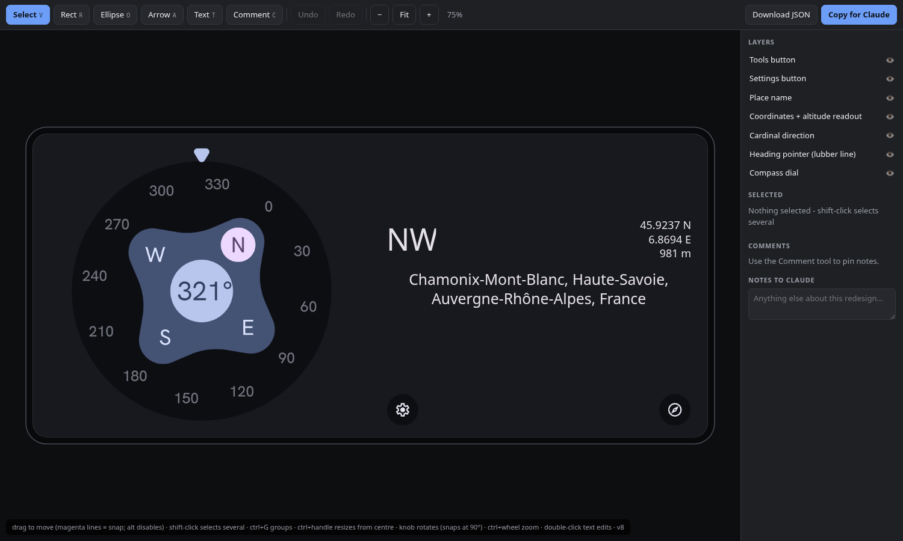
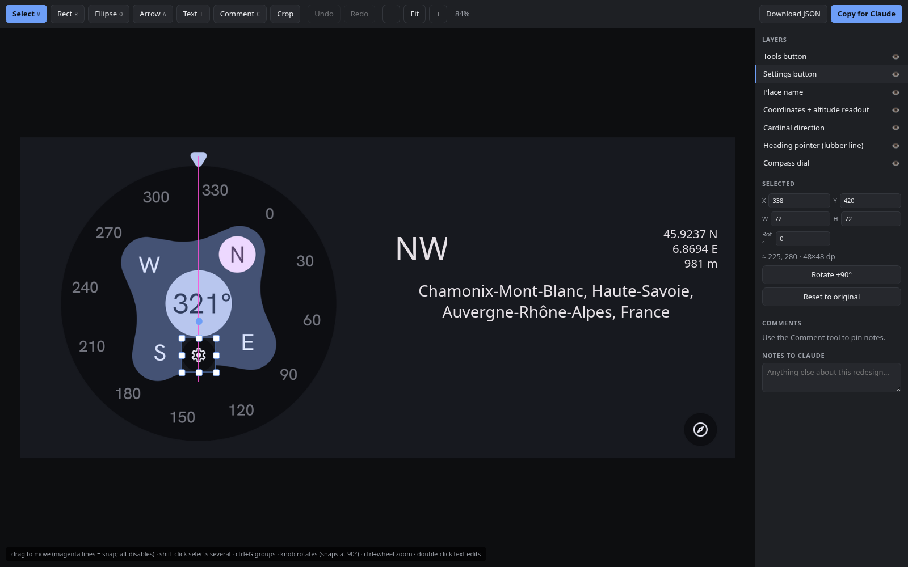
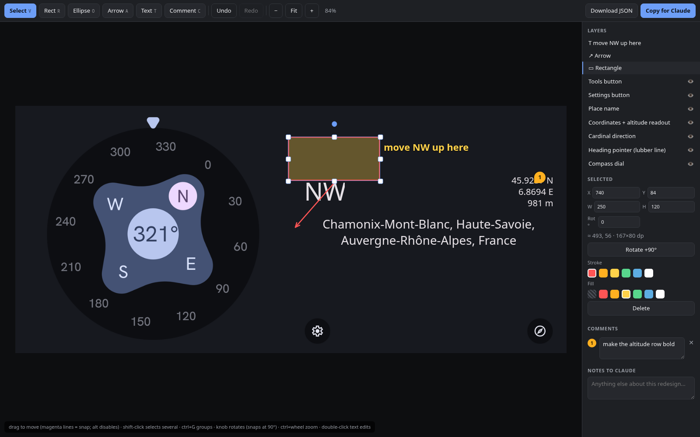
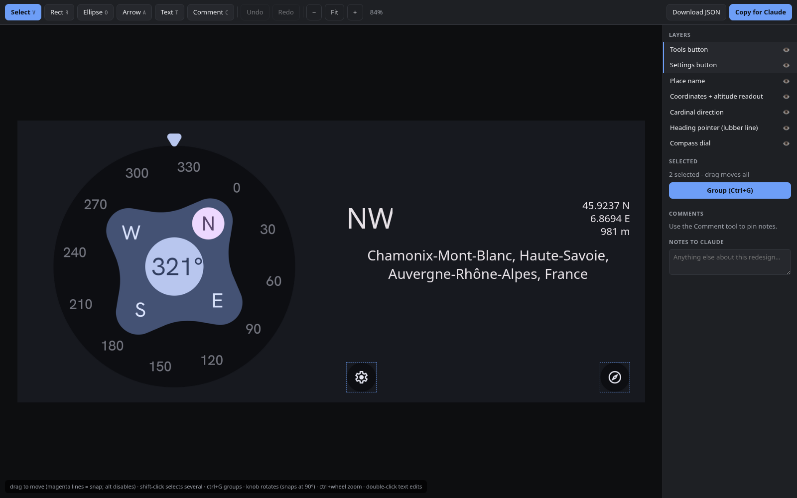
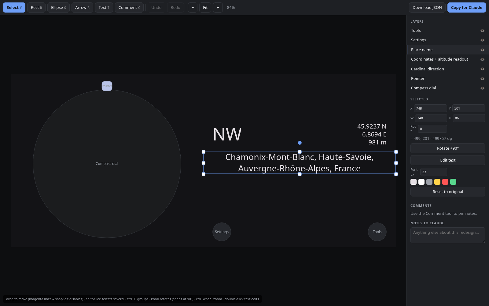

# interface-modify

**Intuitive Android interface modifying for Claude.**

Stop describing UI changes in words. This [Claude Code](https://claude.com/claude-code)
skill turns any screen of your Android app into a mini-Figma editor: you drag the real UI
elements where you want them, and Claude writes the layout code to match. Every edit
round-trips through a **structured JSON export** (before/after geometry in px *and* dp,
rewritten text, groups, annotated comments) that you can also use standalone: version it,
diff it, or feed it to any other tool.



Tell Claude `/interface-modify "the screen at the beginning" landscape` and it:

1. **Figures out which screen you mean.** The argument is plain English: a name, a
   description, "the page with the ruler". Claude resolves it against your manifest,
   fragments, and navigation, and tells you what it picked before doing anything.
2. **Captures or reconstructs it.** With an emulator/device running, it screenshots the
   real thing, pixel-true. With **no device at all**, code mode kicks in: Claude reads your
   layout XML, strings, and theme, computes the geometry with the same dp math Android
   uses, and rebuilds the screen as live text plus themed placeholders.
3. **Publishes an interactive editor** (a private Claude Artifact) where every real UI
   element is a draggable layer.
4. You **redesign visually**: drag with smart alignment guides, resize, rotate, crop,
   rewrite text in place, group things, add shapes and arrows, pin numbered comments. Then
   click **Copy for Claude**.
5. Claude **interprets** the exported JSON into concrete layout code changes
   (ConstraintLayout constraints, margins, string resources), rebuilds the app, and shows
   you the result.

Your visual edit becomes the spec. No more describing positions in words.

## Install

Paste this to Claude Code:

> Install the interface-modify skill from https://github.com/ItzSkyeYT/claude-interface-modify

or manually:

```bash
git clone https://github.com/ItzSkyeYT/claude-interface-modify ~/.claude/skills/interface-modify
```

(Per-project install: clone into `<project>/.claude/skills/interface-modify` instead.)

## Requirements

- Claude Code with a claude.ai login (the editor is published as a private Artifact)
- Python 3 with [Pillow](https://pypi.org/project/pillow/) (`pip install pillow`)
- Optional: `adb` with a running emulator or connected device, for pixel-true capture.
  Without one, code mode reconstructs the screen from source and needs nothing at all.

## Usage

```
/interface-modify <screen> [portrait|landscape]
```

- `<screen>`: anything that identifies the screen. An id like `main_screen`, or plain
  English like `"the screen at the beginning"` or `"the settings page"`. Claude resolves
  it and states its interpretation so a wrong guess is caught immediately.
- orientation: which layout variant to capture and, later, which layout file the edits
  land in (`res/layout/` vs `res/layout-land/`). Omitted = current device orientation.

### In the editor

| Action | How |
|---|---|
| Move | drag; magenta smart guides snap edges/centres, Slides-style (**Alt** disables) |
| Multi-select / group | **shift-click**, then **Ctrl+G** (Ctrl+Shift+G ungroups) |
| Resize | 8 handles, **shift** keeps aspect; text boxes reflow like Google Slides (sides rewrap, top/bottom add space but never clip, corners scale the text) |
| Rotate | knob above the selection, snaps at 0/90/180/270; **shift** = 15 degree steps |
| Crop | select an image layer, then the **Crop** button |
| Edit text | double-click any text (or *Edit text* in the sidebar) |
| Annotate | **R**ect / ellipse (**O**) / **A**rrow / **T**ext label / **C**omment pin, with stroke and fill colours |
| Finish | **Copy for Claude**, then paste the JSON back into the chat |

The export is a diff-shaped document (before/after/delta in device px *and* dp, rewritten
text, style changes, groups, comments with nearest-element hints) designed for an LLM to
translate into layout code. See
[references/export-schema.md](references/export-schema.md).

## What it looks like

Smart guides snap real UI elements into alignment, Google-Slides-style:



Mark up intent with filled shapes, arrows, labels, and numbered comments:



Shift-click to select several elements, group them, and move them as one:



No emulator? Code mode rebuilds the same screen from the layout XML alone. Text is real and
editable; buttons and custom views become themed placeholders at their exact dp positions:



## What's in the box

```
SKILL.md                      the skill definition Claude follows
assets/editor_template.html   the self-contained editor (vanilla JS, no dependencies)
scripts/parse_bounds.py       view-hierarchy to absolute element bounds (works mid-animation)
scripts/prep_assets.py        crop elements, heal background, build the scene
scripts/build_editor.py       inject the scene into the template
references/export-schema.md   the interface-modify/v1 export format + interpretation rules
```

## Known limits

- Code mode is a faithful reconstruction, not a pixel screenshot: geometry is exact
  (it comes from the same dp values), visuals are placeholders
- Background "healing" behind lifted elements assumes a flat background colour
- Groups move as one but don't yet resize/rotate as a unit
- The editor targets desktop browsers (mouse + keyboard)

## License

MIT
